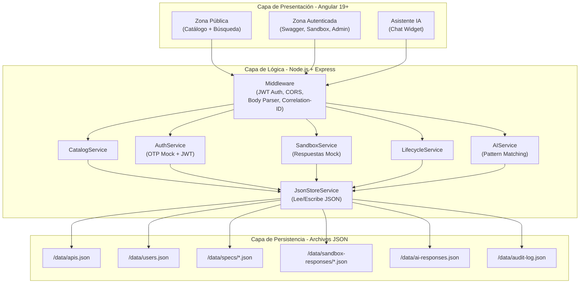
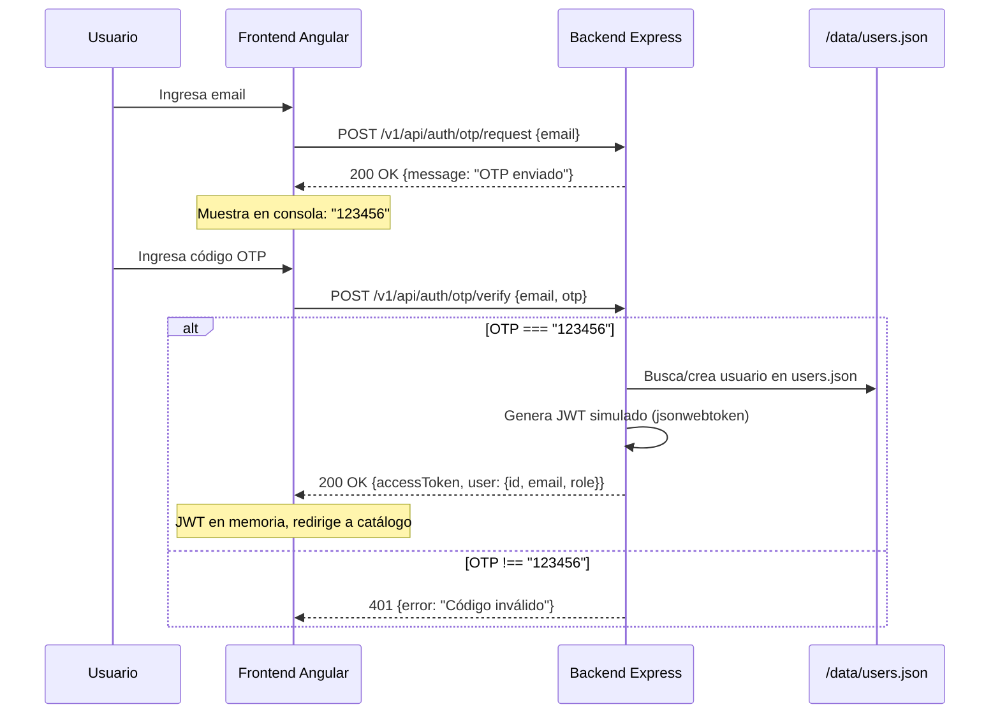
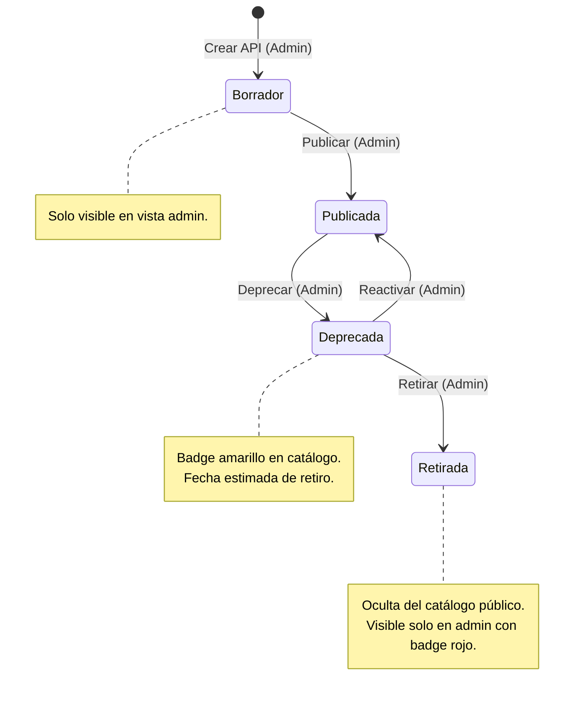
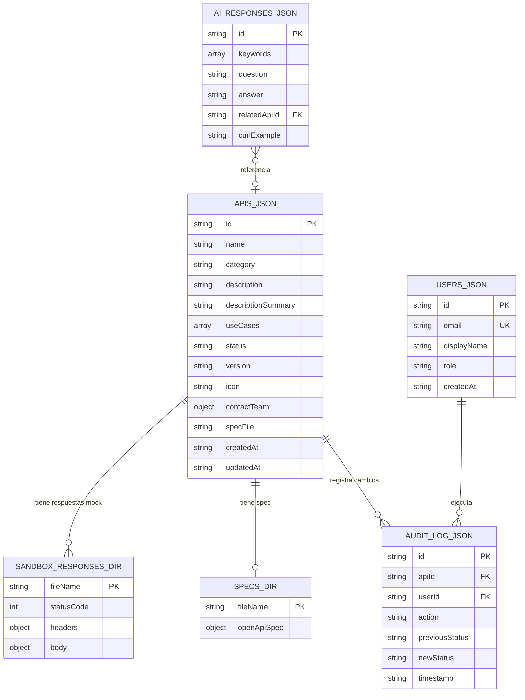

# Documento de Diseño — Portal de APIs Empresarial (Proyecto SIOP) — MVP Hackathon

## Visión General

Este documento describe el diseño técnico simplificado del MVP del Portal de APIs de Seguros Bolívar (Proyecto SIOP) para contexto de hackathon. La plataforma centraliza y documenta APIs internas mediante un catálogo interactivo con documentación OpenAPI 3.0, sandbox de pruebas simulado, gobernanza básica del ciclo de vida y un asistente de IA con respuestas pre-construidas.

La arquitectura sigue el estándar corporativo de 3 capas (Presentación, Lógica, Persistencia) simplificado para MVP:
- **Presentación:** Angular 19+ Standalone con `@seguros-bolivar/ui-bundle`
- **Lógica:** Node.js 20.x + Express.js 4.x
- **Persistencia:** Archivos JSON en carpeta `/data` (sin base de datos)

### Restricciones MVP Hackathon

| Restricción | Detalle |
|-------------|---------|
| Tiempo | 1 hora restante para entregar |
| Equipo | 5 personas en paralelo |
| Persistencia | Archivos JSON en `/data` — sin PostgreSQL, sin Redis |
| Servicios externos | Ninguno — sin SMTP, sin S3, sin CloudWatch, sin LLM real |
| Autenticación | OTP simulado con código fijo "123456" |
| IA | Respuestas pre-construidas con pattern matching simple |
| Sandbox | Respuestas mock predefinidas en JSON |

### Decisiones de Diseño Clave

| Decisión | Justificación |
|----------|---------------|
| Angular 19+ Standalone (sin NgModules) | Estándar corporativo, lazy loading nativo |
| Express.js 4.x | Ecosistema maduro, setup rápido |
| JSON files en `/data` en lugar de PostgreSQL | Cero configuración, funciona inmediatamente, suficiente para demo |
| OTP fijo "123456" | Demuestra flujo de seguridad sin SMTP real |
| swagger-ui-dist embebido | Renderizado nativo OpenAPI 3.0, diferenciador técnico |
| Respuestas IA pre-construidas | Factor wow sin dependencia de LLM externo |
| `json-store.service.ts` centralizado | Un solo punto de lectura/escritura de JSON, fácil de reemplazar por BD real post-hackathon |

---

## Arquitectura

### Diagrama de Arquitectura de Alto Nivel (MVP)



### Diagrama de Flujo de Autenticación OTP (MVP Simulado)



### Diagrama de Flujo del Ciclo de Vida de APIs (MVP)



---

## Componentes e Interfaces

### Frontend (Angular 19+ Standalone)

#### Estructura de Módulos por Feature (MVP)

```
frontend/src/app/
├── core/
│   ├── config/
│   │   └── api.config.ts              # URLs del Backend
│   ├── guards/
│   │   └── auth.guard.ts              # CanActivateFn - verifica JWT en memoria
│   ├── interceptors/
│   │   ├── auth.interceptor.ts        # Inyecta JWT en headers
│   │   └── correlation-id.interceptor.ts  # Genera Correlation-ID (UUID)
│   ├── models/
│   │   ├── api-catalog.model.ts       # Interfaces del catálogo
│   │   ├── auth.model.ts              # Interfaces de autenticación
│   │   └── sandbox.model.ts           # Interfaces del sandbox
│   └── services/
│       ├── auth.service.ts            # Login OTP mock + JWT
│       ├── catalog.service.ts         # Lectura catálogo
│       ├── sandbox.service.ts         # Peticiones sandbox mock
│       ├── lifecycle.service.ts       # Gestión ciclo de vida
│       └── ai-assistant.service.ts    # Chat con IA mock
├── features/
│   ├── public-catalog/                # Catálogo público + búsqueda
│   │   ├── catalog-list.component.ts
│   │   ├── catalog-detail.component.ts
│   │   └── catalog-search.component.ts
│   ├── auth/                          # Login OTP simulado
│   │   ├── login.component.ts
│   │   └── otp-verify.component.ts
│   ├── swagger-viewer/                # Visor Swagger embebido
│   │   └── swagger-viewer.component.ts
│   ├── sandbox/                       # Sandbox interactivo
│   │   ├── sandbox.component.ts
│   │   ├── request-builder.component.ts
│   │   └── response-viewer.component.ts
│   ├── ai-assistant/                  # Chat IA
│   │   └── ai-chat.component.ts
│   └── api-management/                # Gestión ciclo de vida (Admin)
│       ├── api-create.component.ts
│       └── api-lifecycle.component.ts
├── shared/
│   ├── components/
│   │   ├── header.component.ts
│   │   ├── sidebar.component.ts
│   │   └── loading-spinner.component.ts
│   └── styles/
│       └── admin-layout.scss
├── app.component.ts
├── app.config.ts
└── app.routes.ts
```

#### Interfaces Principales del Frontend

```typescript
// core/models/api-catalog.model.ts
export interface ApiCatalogItem {
  id: string;
  name: string;
  category: string;
  description: string;
  descriptionSummary: string;
  useCases: string[];
  status: ApiStatus;
  version: string;
  contactTeam: ContactInfo;
  icon: string;
  createdAt: string;
  updatedAt: string;
}

export type ApiStatus = 'Borrador' | 'Publicada' | 'Deprecada' | 'Retirada';

export interface ContactInfo {
  teamName: string;
  email: string;
  area: string;
}

export interface CatalogSearchParams {
  query?: string;
  category?: string;
}
```

```typescript
// core/models/auth.model.ts
export interface OtpRequestPayload {
  email: string;
}

export interface OtpVerifyPayload {
  email: string;
  otp: string;
}

export interface AuthSession {
  accessToken: string;
  user: UserProfile;
}

export interface UserProfile {
  id: string;
  email: string;
  role: UserRole;
  displayName: string;
}

export type UserRole = 'Externo' | 'Admin';
```

```typescript
// core/models/sandbox.model.ts
export interface SandboxRequest {
  apiId: string;
  endpoint: string;
  method: HttpMethod;
  headers?: Record<string, string>;
  body?: unknown;
}

export interface SandboxResponse {
  statusCode: number;
  headers: Record<string, string>;
  body: unknown;
  responseTimeMs: number;
  correlationId: string;
}

export type HttpMethod = 'GET' | 'POST' | 'PUT' | 'DELETE';
```

### Backend (Node.js + Express.js)

#### Estructura del Backend (MVP)

```
backend/src/
├── config/
│   └── app.config.ts              # Variables de entorno, paths de JSON
├── middleware/
│   ├── auth.middleware.ts          # Verificación JWT simple (jsonwebtoken)
│   ├── correlation-id.middleware.ts # Genera UUID por petición
│   └── error-handler.middleware.ts # Manejo global de errores
├── controllers/
│   ├── auth.controller.ts         # POST /otp/request, /otp/verify
│   ├── catalog.controller.ts      # GET /catalog, /catalog/:id
│   ├── sandbox.controller.ts      # POST /sandbox/execute
│   ├── lifecycle.controller.ts    # POST /apis, PATCH /apis/:id/status
│   └── ai.controller.ts           # POST /ai/assistant
├── services/
│   ├── json-store.service.ts      # Lee/escribe archivos JSON de /data
│   ├── auth.service.ts            # Lógica OTP mock + JWT
│   ├── catalog.service.ts         # Lógica del catálogo (filtro, búsqueda)
│   ├── sandbox.service.ts         # Retorna respuestas mock
│   ├── lifecycle.service.ts       # Máquina de estados + auditoría
│   └── ai-assistant.service.ts    # Pattern matching sobre ai-responses.json
├── routes/
│   └── v1/
│       ├── auth.routes.ts
│       ├── catalog.routes.ts
│       ├── sandbox.routes.ts
│       ├── lifecycle.routes.ts
│       ├── ai.routes.ts
│       └── index.ts               # Registro de todas las rutas v1
├── types/
│   └── index.ts                   # Tipos compartidos
└── app.ts                         # Configuración Express + middleware
```

#### Servicio Central: JsonStoreService

```typescript
// services/json-store.service.ts
import fs from 'fs/promises';
import path from 'path';

const DATA_DIR = path.join(__dirname, '../../data');

export class JsonStoreService {
  /** Lee un archivo JSON completo de /data */
  async read<T>(fileName: string): Promise<T> {
    const filePath = path.join(DATA_DIR, fileName);
    const content = await fs.readFile(filePath, 'utf-8');
    return JSON.parse(content) as T;
  }

  /** Escribe un objeto completo a un archivo JSON en /data */
  async write<T>(fileName: string, data: T): Promise<void> {
    const filePath = path.join(DATA_DIR, fileName);
    await fs.writeFile(filePath, JSON.stringify(data, null, 2), 'utf-8');
  }

  /** Lee un archivo de spec OpenAPI de /data/specs/ */
  async readSpec(specFileName: string): Promise<unknown> {
    return this.read(`specs/${specFileName}`);
  }

  /** Lee respuestas mock de sandbox de /data/sandbox-responses/ */
  async readSandboxResponse(apiId: string, scenario: string): Promise<unknown> {
    return this.read(`sandbox-responses/${apiId}-${scenario}.json`);
  }
}
```

#### API REST — Endpoints MVP (~15 endpoints)

| Método | Ruta | Auth | Descripción |
|--------|------|------|-------------|
| `GET` | `/v1/api/catalog` | No | Lista APIs publicadas (catálogo público) |
| `GET` | `/v1/api/catalog/:id` | No | Detalle público de una API |
| `GET` | `/v1/api/catalog/search?q=` | No | Búsqueda en catálogo |
| `POST` | `/v1/api/auth/otp/request` | No | Solicitar OTP (simulado) |
| `POST` | `/v1/api/auth/otp/verify` | No | Verificar OTP → JWT |
| `GET` | `/v1/api/catalog/:id/spec` | JWT | Spec OpenAPI completa |
| `POST` | `/v1/api/sandbox/execute` | JWT | Ejecutar petición sandbox mock |
| `GET` | `/v1/api/sandbox/history` | JWT | Historial de sandbox (en memoria) |
| `POST` | `/v1/api/ai/assistant` | JWT | Consulta al asistente IA |
| `GET` | `/v1/api/apis` | JWT+Admin | Lista todas las APIs (incluye Borrador/Retirada) |
| `POST` | `/v1/api/apis` | JWT+Admin | Crear nueva API (estado Borrador) |
| `PATCH` | `/v1/api/apis/:id/status` | JWT+Admin | Cambiar estado de API |
| `GET` | `/v1/api/apis/:id/audit` | JWT+Admin | Log de auditoría de una API |
| `GET` | `/v1/api/auth/me` | JWT | Perfil del usuario actual |

#### Firmas de Servicios Clave (MVP)

```typescript
// services/auth.service.ts
export class AuthService {
  constructor(private store: JsonStoreService) {}

  /** Simula envío de OTP. Siempre retorna éxito. */
  async requestOtp(email: string): Promise<{ message: string }>;

  /** Verifica OTP fijo "123456". Crea usuario si no existe. Retorna JWT. */
  async verifyOtp(email: string, otp: string): Promise<{ accessToken: string; user: UserProfile }>;
}

// services/catalog.service.ts
export class CatalogService {
  constructor(private store: JsonStoreService) {}

  /** Retorna APIs con estado "Publicada" desde apis.json */
  async getPublicApis(): Promise<ApiCatalogItem[]>;

  /** Busca APIs por nombre, categoría o descripción (case-insensitive) */
  async search(query: string): Promise<ApiCatalogItem[]>;

  /** Retorna detalle de una API (vista pública: sin endpoints ni auth schemas) */
  async getPublicDetail(apiId: string): Promise<ApiCatalogItem | null>;

  /** Retorna spec OpenAPI completa de una API */
  async getSpec(apiId: string): Promise<unknown>;
}

// services/sandbox.service.ts
export class SandboxService {
  private history: Map<string, SandboxHistoryEntry[]> = new Map();

  constructor(private store: JsonStoreService) {}

  /** Retorna respuesta mock predefinida. Agrega responseTimeMs y correlationId. */
  async execute(request: SandboxRequest, userId: string): Promise<SandboxResponse>;

  /** Retorna últimas 10 peticiones del usuario */
  getHistory(userId: string): SandboxHistoryEntry[];
}

// services/lifecycle.service.ts
export class LifecycleService {
  constructor(private store: JsonStoreService) {}

  /** Crea API en estado Borrador */
  async createApi(data: CreateApiPayload, userId: string): Promise<ApiCatalogItem>;

  /** Cambia estado validando transiciones permitidas. Registra auditoría. */
  async changeStatus(apiId: string, newStatus: ApiStatus, userId: string): Promise<ApiCatalogItem>;

  /** Retorna log de auditoría de una API */
  async getAuditLog(apiId: string): Promise<AuditEntry[]>;
}

// services/ai-assistant.service.ts
export class AIAssistantService {
  constructor(private store: JsonStoreService) {}

  /** Busca respuesta por pattern matching de keywords. Retorna respuesta pre-construida. */
  async query(userMessage: string): Promise<AIResponse>;
}
```

### Middleware Stack MVP (Orden de Ejecución)

```typescript
// app.ts — Middleware simplificado para MVP
app.use(cors({ origin: 'http://localhost:4200', credentials: true }));
app.use(express.json());                        // 1. Body parser
app.use(correlationIdMiddleware);               // 2. Genera UUID en header X-Correlation-ID
// 3. Rutas públicas (sin auth)
app.use('/v1/api/catalog', catalogRoutes);
app.use('/v1/api/auth', authRoutes);
// 4. Rutas protegidas (con auth)
app.use('/v1/api', authMiddleware);             // Verifica JWT
app.use('/v1/api/sandbox', sandboxRoutes);
app.use('/v1/api/ai', aiRoutes);
app.use('/v1/api/apis', lifecycleRoutes);       // Admin check dentro del controller
// 5. Error handler global
app.use(errorHandlerMiddleware);
```

---

## Modelos de Datos

### Estructura de Archivos JSON en `/data`

En lugar de base de datos, el MVP usa archivos JSON planos. El `JsonStoreService` centraliza toda lectura/escritura.

```
data/
├── apis.json                      # Catálogo de APIs
├── users.json                     # Usuarios registrados
├── audit-log.json                 # Log de cambios de ciclo de vida
├── ai-responses.json              # Respuestas pre-construidas del asistente IA
├── specs/                         # Especificaciones OpenAPI
│   ├── emision-polizas.json
│   ├── consulta-siniestros.json
│   └── cotizacion-seguros.json
└── sandbox-responses/             # Respuestas mock del sandbox
    ├── emision-polizas-200.json
    ├── emision-polizas-400.json
    ├── consulta-siniestros-200.json
    ├── consulta-siniestros-404.json
    ├── cotizacion-seguros-200.json
    └── cotizacion-seguros-500.json
```

### Diagrama de Relaciones entre Archivos JSON



### Estructura JSON de Cada Archivo

#### `/data/apis.json`
```json
[
  {
    "id": "api-001",
    "name": "API de Emisión de Pólizas",
    "category": "Emisión",
    "description": "API para la emisión y generación de nuevas pólizas de seguros...",
    "descriptionSummary": "Emisión y generación de pólizas de seguros",
    "useCases": ["Emitir póliza nueva", "Generar certificado", "Validar datos del asegurado"],
    "status": "Publicada",
    "version": "v1",
    "icon": "fa-file-contract",
    "contactTeam": {
      "teamName": "Equipo Core Seguros",
      "email": "core-seguros@segurosbolivar.com",
      "area": "Tecnología"
    },
    "specFile": "emision-polizas.json",
    "createdAt": "2024-01-15T10:00:00Z",
    "updatedAt": "2024-06-01T14:30:00Z"
  }
]
```

#### `/data/users.json`
```json
[
  {
    "id": "user-001",
    "email": "admin@segurosbolivar.com",
    "displayName": "Administrador SIOP",
    "role": "Admin",
    "createdAt": "2024-01-01T00:00:00Z"
  },
  {
    "id": "user-002",
    "email": "demo@segurosbolivar.com",
    "displayName": "Usuario Demo",
    "role": "Externo",
    "createdAt": "2024-01-01T00:00:00Z"
  }
]
```

#### `/data/audit-log.json`
```json
[]
```

#### `/data/ai-responses.json`
```json
[
  {
    "id": "ai-001",
    "keywords": ["emitir", "póliza", "nueva", "emisión", "generar"],
    "question": "¿Cómo emitir una póliza?",
    "answer": "Para emitir una nueva póliza, utiliza la **API de Emisión de Pólizas**. Esta API permite crear pólizas de seguros proporcionando los datos del asegurado, tipo de cobertura y plan seleccionado.",
    "relatedApiId": "api-001",
    "curlExample": "curl -X POST https://api.segurosbolivar.com/v1/polizas/emitir -H 'Authorization: Bearer {token}' -H 'Content-Type: application/json' -d '{\"asegurado\": {\"nombre\": \"Juan Pérez\", \"documento\": \"1234567890\"}, \"plan\": \"vida-plus\"}'"
  }
]
```

#### `/data/sandbox-responses/emision-polizas-200.json`
```json
{
  "statusCode": 200,
  "headers": {
    "Content-Type": "application/json",
    "X-Request-Id": "mock-req-001"
  },
  "body": {
    "success": true,
    "data": {
      "polizaId": "POL-2024-001234",
      "estado": "Emitida",
      "asegurado": {
        "nombre": "Juan Carlos Pérez López",
        "documento": "1234567890",
        "tipoDocumento": "CC"
      },
      "plan": {
        "nombre": "Vida Plus",
        "cobertura": "Muerte + Incapacidad",
        "primaAnual": 2450000
      },
      "vigencia": {
        "inicio": "2024-07-01",
        "fin": "2025-07-01"
      }
    }
  }
}
```

#### `/data/specs/emision-polizas.json` (estructura resumida)
```json
{
  "openapi": "3.0.3",
  "info": {
    "title": "API de Emisión de Pólizas",
    "version": "1.0.0",
    "description": "API para la emisión y generación de nuevas pólizas de seguros de Seguros Bolívar"
  },
  "servers": [{ "url": "https://sandbox.segurosbolivar.com/v1" }],
  "paths": {
    "/polizas/emitir": {
      "post": {
        "summary": "Emitir nueva póliza",
        "operationId": "emitirPoliza",
        "requestBody": { "..." : "schema con datos del asegurado y plan" },
        "responses": {
          "200": { "description": "Póliza emitida exitosamente" },
          "400": { "description": "Datos inválidos" },
          "500": { "description": "Error interno" }
        }
      }
    }
  }
}
```

---

## Propiedades de Correctitud

*Una propiedad es una característica o comportamiento que debe cumplirse en todas las ejecuciones válidas de un sistema — esencialmente, una declaración formal sobre lo que el sistema debe hacer. Las propiedades sirven como puente entre especificaciones legibles por humanos y garantías de correctitud verificables por máquinas.*

### Propiedad 1: Búsqueda en catálogo retorna solo resultados coincidentes

*Para cualquier* conjunto de APIs publicadas y cualquier texto de búsqueda, todos los resultados retornados SHALL contener el texto buscado en al menos uno de los campos: nombre, categoría o descripción (case-insensitive). Además, no SHALL existir ninguna API publicada que coincida con el criterio y no esté incluida en los resultados.

**Valida: Requisitos 1.3**

### Propiedad 2: Visibilidad de APIs por estado en catálogo

*Para cualquier* conjunto de APIs con distintos estados, el catálogo público SHALL mostrar únicamente APIs con estado "Publicada" o "Deprecada" (con indicador visual). APIs en estado "Borrador" o "Retirada" SHALL ser excluidas del catálogo público y visibles solo en la vista de administración. La vista pública de cada API SHALL incluir solo nombre, categoría, descripción resumida, casos de uso e ícono, excluyendo endpoints, esquemas de request/response y datos de autenticación.

**Valida: Requisitos 1.1, 1.4, 6.3, 6.4**

### Propiedad 3: Flujo OTP produce sesión válida con rol correcto

*Para cualquier* email válido, verificar con el OTP "123456" SHALL producir un JWT que contenga el userId, email y rol del usuario. Si el email no existe en users.json, SHALL crear un nuevo usuario con rol "Externo". Si el email ya existe, SHALL retornar el rol existente (incluyendo "Admin" para admin@segurosbolivar.com).

**Valida: Requisitos 3.2, 3.4, 3.5**

### Propiedad 4: Sandbox retorna respuesta mock válida con metadatos

*Para cualquier* petición al sandbox con una combinación válida de apiId, endpoint y método HTTP, la respuesta SHALL incluir: un statusCode HTTP válido, headers, body de respuesta, un responseTimeMs entre 50 y 500 milisegundos, y un correlationId en formato UUID. El historial SHALL mantener las últimas 10 peticiones del usuario, descartando las más antiguas cuando se excede el límite.

**Valida: Requisitos 4.1, 4.4, 4.5**

### Propiedad 5: Asistente IA retorna respuesta relevante con información de API

*Para cualquier* consulta del usuario que contenga al menos una palabra clave definida en ai-responses.json, el asistente SHALL retornar la respuesta pre-construida cuyas keywords tengan mayor coincidencia. Cuando la respuesta referencia una API, SHALL incluir el nombre de la API, un enlace al visor Swagger y un ejemplo de código cURL.

**Valida: Requisitos 5.1, 5.3**

### Propiedad 6: Transiciones de estado del ciclo de vida son válidas

*Para cualquier* API y cualquier intento de cambio de estado, el sistema SHALL aceptar la transición si y solo si es una de las transiciones permitidas: Borrador→Publicada, Publicada→Deprecada, Deprecada→Retirada, Deprecada→Publicada. Cualquier otra transición SHALL ser rechazada. Crear una nueva API SHALL asignar automáticamente el estado "Borrador".

**Valida: Requisitos 6.1, 6.5**

### Propiedad 7: Auditoría completa por cambio de estado

*Para cualquier* transición de estado exitosa de una API, el sistema SHALL registrar en audit-log.json una entrada que contenga: id único, apiId, userId del administrador, acción realizada, estado anterior, estado nuevo y timestamp. El número de entradas en audit-log.json SHALL crecer en exactamente 1 por cada transición exitosa.

**Valida: Requisitos 6.2**

---

## Manejo de Errores

### Estrategia de Errores (MVP Simplificado)

| Capa | Tipo de Error | Manejo |
|------|--------------|--------|
| Frontend | Error de red | Mostrar mensaje "Error de conexión con el servidor" con botón de reintentar |
| Frontend | 401 Unauthorized | Redirigir a pantalla de login, limpiar JWT de memoria |
| Frontend | 404 Not Found | Mostrar mensaje "Recurso no encontrado" |
| Backend | JSON file no encontrado | Retornar 500 con mensaje descriptivo en log |
| Backend | JSON parse error | Retornar 500, log del error con correlation-id |
| Backend | Validación de payload | Retornar 400 con detalle del campo inválido |
| Backend | OTP incorrecto | Retornar 401 con mensaje "Código inválido" |
| Backend | Transición de estado inválida | Retornar 400 con mensaje "Transición no permitida de {anterior} a {nuevo}" |
| Backend | API no encontrada | Retornar 404 con mensaje "API no encontrada" |

### Formato Estándar de Error

```typescript
interface ApiError {
  error: string;
  message: string;
  correlationId: string;
  statusCode: number;
}
```

---

## Estrategia de Testing

### Enfoque Dual: Unit Tests + Property Tests

El MVP utiliza un enfoque dual de testing:

- **Unit tests (Jest + Supertest):** Verifican ejemplos específicos, edge cases y flujos de integración entre componentes
- **Property tests (fast-check + Jest):** Verifican propiedades universales que deben cumplirse para todos los inputs válidos

### Configuración de Property Tests

- Librería: `fast-check` (JavaScript/TypeScript)
- Framework: Jest 30.x
- Mínimo 100 iteraciones por propiedad
- Cada test referencia su propiedad del documento de diseño
- Tag format: `Feature: api-portal-platform, Property {N}: {título}`

### Cobertura de Testing por Componente

| Componente | Unit Tests | Property Tests |
|-----------|-----------|---------------|
| CatalogService (búsqueda, filtro) | Ejemplos de búsqueda | Propiedad 1, 2 |
| AuthService (OTP, JWT) | Flujo login exitoso/fallido | Propiedad 3 |
| SandboxService (mock responses) | Escenarios 200/400/404/500 | Propiedad 4 |
| AIAssistantService (pattern matching) | Queries conocidas/desconocidas | Propiedad 5 |
| LifecycleService (estados, auditoría) | Transiciones válidas/inválidas | Propiedad 6, 7 |
| JsonStoreService (read/write) | Lectura/escritura de archivos | — |
| Middleware (auth, correlation-id) | JWT válido/inválido/expirado | — |

### Notas sobre Testing en Hackathon

- Priorizar tests de servicios backend (lógica de negocio)
- Los tests de frontend se limitan a verificar que los componentes renderizan sin errores
- No se requiere cobertura de e2e para el MVP
- Los mocks de archivos JSON se usan directamente en los tests (no se mockea el filesystem)

---

## Distribución de Trabajo por Persona

### Persona 1: Backend Core + Auth
**Archivos:** `backend/src/app.ts`, `config/`, `middleware/`, `services/json-store.service.ts`, `services/auth.service.ts`, `controllers/auth.controller.ts`, `routes/v1/auth.routes.ts`

| Tarea | Tiempo Est. |
|-------|------------|
| Inicializar proyecto Express + TypeScript + estructura de carpetas | 10 min |
| Implementar `JsonStoreService` (read/write JSON) | 5 min |
| Implementar middleware: CORS, body-parser, correlation-id, error-handler | 10 min |
| Implementar `AuthService` (OTP mock "123456" + JWT con jsonwebtoken) | 10 min |
| Implementar `auth.middleware.ts` (verificación JWT) | 5 min |
| Implementar rutas de auth + controller | 5 min |

### Persona 2: Frontend Shell + Auth + Shared
**Archivos:** `frontend/` (inicialización), `core/`, `features/auth/`, `shared/`, `app.routes.ts`

| Tarea | Tiempo Est. |
|-------|------------|
| Inicializar proyecto Angular 19+ con `@seguros-bolivar/ui-bundle` | 10 min |
| Configurar `angular.json` (CSS/JS bundle), `index.html` (data-brand/theme) | 5 min |
| Crear estructura core/ (config, guards, interceptors, models, services) | 5 min |
| Implementar `auth.guard.ts`, `auth.interceptor.ts`, `correlation-id.interceptor.ts` | 5 min |
| Implementar `features/auth/` (login + OTP verify) | 10 min |
| Implementar `shared/` (header, sidebar, spinner) + `app.routes.ts` | 10 min |

### Persona 3: Catálogo (Frontend + Backend)
**Archivos:** `features/public-catalog/`, `services/catalog.service.ts` (front+back), `controllers/catalog.controller.ts`, `routes/v1/catalog.routes.ts`

| Tarea | Tiempo Est. |
|-------|------------|
| Backend: `CatalogService` (getPublicApis, search, getDetail, getSpec) | 10 min |
| Backend: `catalog.controller.ts` + `catalog.routes.ts` | 5 min |
| Frontend: `catalog.service.ts` (HTTP client) | 5 min |
| Frontend: `catalog-list.component.ts` (grid de cards con búsqueda) | 15 min |
| Frontend: `catalog-detail.component.ts` (detalle de API) | 10 min |

### Persona 4: Swagger Viewer + Sandbox (Frontend + Backend)
**Archivos:** `features/swagger-viewer/`, `features/sandbox/`, `services/sandbox.service.ts` (front+back), `controllers/sandbox.controller.ts`

| Tarea | Tiempo Est. |
|-------|------------|
| Backend: `SandboxService` (execute mock, history) | 10 min |
| Backend: `sandbox.controller.ts` + `sandbox.routes.ts` | 5 min |
| Frontend: `swagger-viewer.component.ts` (swagger-ui-dist embebido) | 10 min |
| Frontend: `sandbox.component.ts` + `request-builder` + `response-viewer` | 15 min |
| Frontend: `sandbox.service.ts` (HTTP client) | 5 min |

### Persona 5: IA + Lifecycle + Datos Mock
**Archivos:** `features/ai-assistant/`, `features/api-management/`, `services/ai-assistant.service.ts`, `services/lifecycle.service.ts`, `/data/*`

| Tarea | Tiempo Est. |
|-------|------------|
| Crear todos los archivos JSON mock en `/data` (apis, users, specs, sandbox-responses, ai-responses) | 15 min |
| Backend: `AIAssistantService` (pattern matching keywords) | 5 min |
| Backend: `LifecycleService` (createApi, changeStatus, auditLog) | 10 min |
| Backend: controllers + routes para ai y lifecycle | 5 min |
| Frontend: `ai-chat.component.ts` (chat con typing effect) | 10 min |

---

## Datos Mock

### Resumen de Archivos Mock Requeridos

| Archivo | Contenido | Registros |
|---------|-----------|-----------|
| `/data/apis.json` | Catálogo de APIs del dominio asegurador | 10 APIs |
| `/data/users.json` | Usuarios precargados | 2 (Admin + Externo) |
| `/data/audit-log.json` | Log de auditoría (vacío inicialmente) | 0 |
| `/data/ai-responses.json` | Respuestas pre-construidas del asistente IA | 15+ pares |
| `/data/specs/emision-polizas.json` | Spec OpenAPI completa | 1 spec |
| `/data/specs/consulta-siniestros.json` | Spec OpenAPI completa | 1 spec |
| `/data/specs/cotizacion-seguros.json` | Spec OpenAPI completa | 1 spec |
| `/data/sandbox-responses/*.json` | Respuestas mock por API y escenario | ~12 archivos |

### Categorías de APIs Mock

| # | Nombre | Categoría | Estado |
|---|--------|-----------|--------|
| 1 | API de Emisión de Pólizas | Emisión | Publicada |
| 2 | API de Renovación de Pólizas | Renovación | Publicada |
| 3 | API de Consulta de Siniestros | Siniestros | Publicada |
| 4 | API de Registro de Siniestros | Siniestros | Publicada |
| 5 | API de Cotización de Seguros | Cotización | Publicada |
| 6 | API de Consulta de Pólizas | Consultas | Publicada |
| 7 | API de Cancelación de Pólizas | Cancelación | Publicada |
| 8 | API de Consulta de Pagos | Pagos | Publicada |
| 9 | API de Autenticación de Clientes | Autenticación | Publicada |
| 10 | API de Notificaciones | Notificaciones | Borrador |
